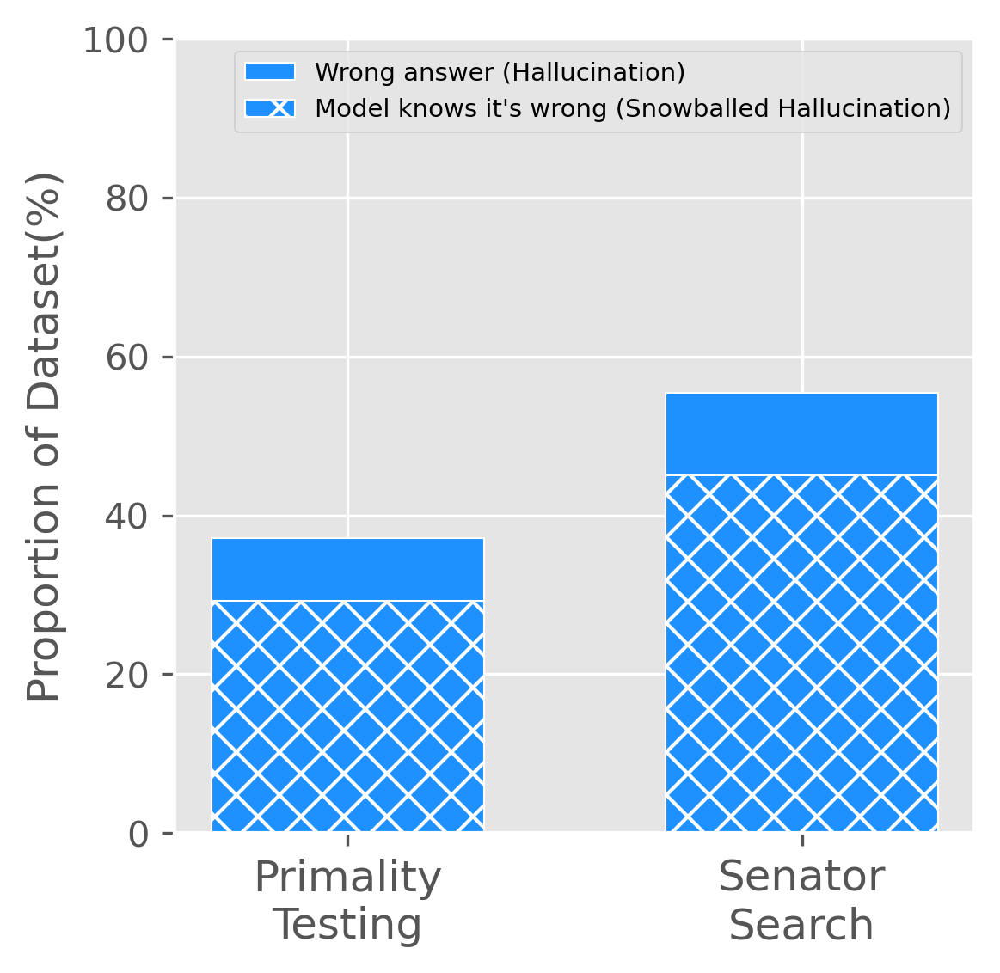
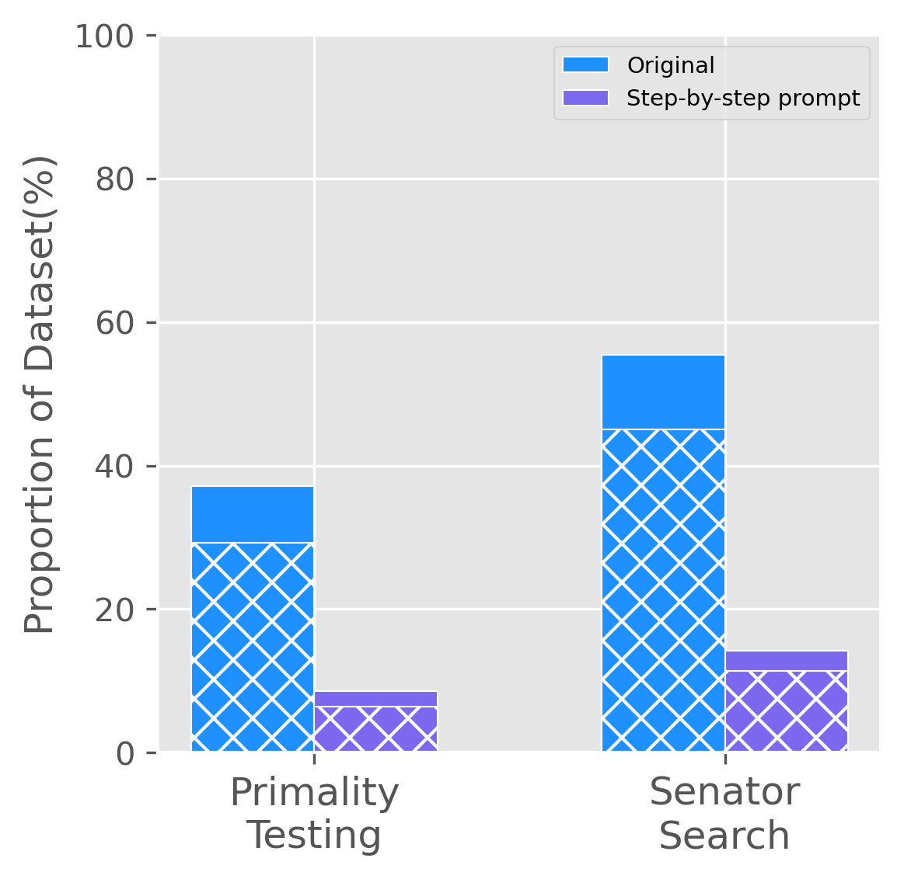
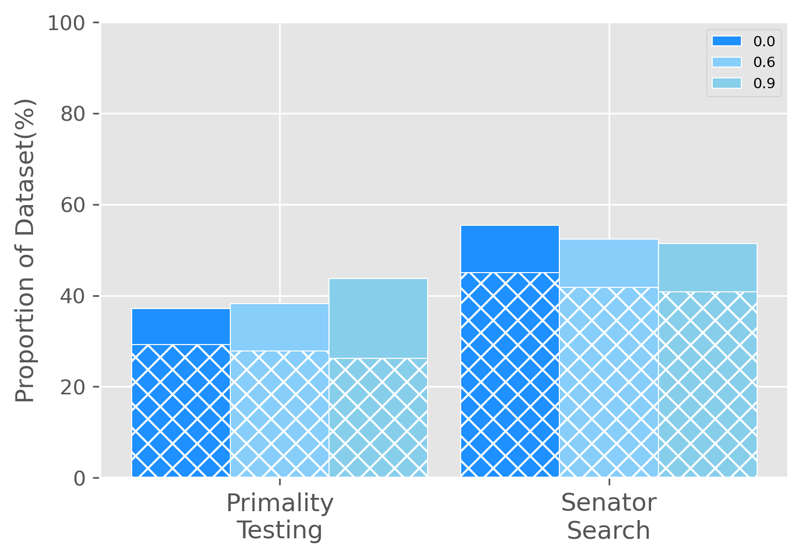

# 2023SpringDataMining课程PJ

20300240003 崔予涵

20300240006 吴骁

20307130017 李雪峰

## 基于数据挖掘方法分析大语言模型的幻觉现象

### 前言

在大语言模型的生成过程中存在一种现象，被称为"幻觉"（hallucination）。幻觉指的是模型生成的文本中包含看似合理但实际上不准确的信息，这可能导致误导和错误的结果。

在生成文本时，大模型受到多个因素的影响，包括训练数据中的偏差、模型的复杂性以及生成过程中的潜在偏好等。这些因素可能导致模型在生成文本时添加不准确的信息，使得生成的文本与训练数据不一致，产生幻觉。相关论文[1](#refer-anchor-1)中提出大模型出现幻觉现象是因为大语言模型每次只生成单个单词，即使每个单词都选取生成概率最大的单词，这些单词连成的句子也有可能是错误的。

### 相关工作

大语言文本生成中的幻觉是一个有着充分研究的问题，有的研究认为这是因为ChatGPT倾向于产生合理的错误。另一些工作将幻觉归因于LM中的知识差距。有一些工作在知识库上使用检索来缓解大语言模型的幻觉现象。最近有一些基于大语言模型本身特性的幻觉识别，如多次向大语言模型提出同一问题或对一个问题进行不断追问。

### 实现方法

本次课程项目我们专注于从大语言模型生成的文本本身进行判断得到其是否出现幻觉现象，具体的实验方法如下：

1. 有论文表明大语言模型的幻觉现象可以从上下文诱导[2](#refer-anchor-2)，即在不断追问的过程中，如果大语言模型在先前的回答中出现了幻觉，其可以在后面被进一步追问的过程中发现自身的错误，我们准备对这一方法加以验证。

### 数据集准备

为了验证追问是否能够让大语言模型认识到自己的错误，我们使用了一个包含500条关于质数问题的数据集，每条数据为一个形如"Is x a prime number?"(x均为质数)的问题，如果LLM回答了No，它会在解释中提供这个数字可以被分解的质因数，我们继续构建继续追问的数据集，对于每一个LLM给出的质因数a，我们构建问题 "Is x divisible by a? Answer with either Yes or No."并再次提问。

我们还使用了另外一个数据集，该数据集由 500 个问题组成，形式为“Was there ever a US senator that represented the state of x and whose alma mater was y？”其中 x 是 美国的一个州，y 是美国的一所特定大学。对于这些问题，正确答案总是No。当模型错误地回答时，我们期望它会给我们参议员的名字。然后我们就可以进一步提问"Has x represented the state of y as US senator?"和 “Was x's alma mater z?”，其中x是大语言模型向我们提供的参议员的姓名，y是我们初始提问中的美国的州名，z是初始提问中的大学的名字。

### 实验细节

​	我们选定了 gpt-3.5-turbo 和gpt-3.5-turbo-0613模型作为研究大型语言模型（LLM）中的幻觉现象的对象。在研究过程中，我们通过OpenAI的API发起了一系列问题。

​	对于质数数据集，在处理模型返回的答案时，我们首先检查"Yes"是否存在于答案字符串中。如果答案中包含"Yes"，那么我们可以判断该LLM在本次问题中的回答是正确的。然而，如果LLM的回答中未出现"Yes"，我们则会借助正则表达式从回答中提取数字。通过少量测试的观察，我们发现LLM的回答会有如下规则：如果LLM认为这个数字不是质数，那么它会提供这个数字可以被分解的质因数。因此，如果我们只提取到一个数字，我们可以推断大型语言模型的回答形式可能为"x is a prime number"。然而，如果我们提取到了多个数字，我们会除去1和原始数字本身，对剩下的每一个数字a，我们将再次向大型语言模型提出问题："Is x divisible by a? Answer with either Yes or No.”。在处理这些数字的所有回答时，只要其中出现了"No"，我们就认为LLM认识到了其先前的错误。通过这种方式，我们可以更深入地理解并分析大型语言模型的幻觉现象。

​		对于参议员数据集，在处理模型返回的答案时，我们首先检查"Yes"是否存在于答案的字符串中，如果答案中包含"Yes",则代表大模型出现了幻觉现象。我们利用正则表达式来提取人名信息，通过过滤掉大学名字，州名等干扰信息，我们就能得到LLM向我们提供的参议员姓名。然后我们再构造"Has x represented the state of y as US senator?"和 “Was x's alma mater z?”，其中x是大语言模型向我们提供的参议员的姓名，y是我们初始提问中的美国的州名，z是初始提问中的大学的名字这两个问题向大模型进行提问，通过在观察"No" 是否在回答中存在，我们判定大模型是否意识到自己之前的错误。

### 实验结果

在质数数据集上，GPT-3.5-turbo判断正确了314个数字是质数，回答正确率为62.8%，在回答错误的186个问题中，LLM在追问中正确认识到了146个他先前的回答错误，占比78.5%,与论文中得到的结果相符。

在参议员数据集上，gpt-3.5-turbo-0613判断正确了223个问题，回答正确率42.6%，在回答错误的277个问题中，LLM在追问中正确认识到了225个自己的错误，占比78.4%。

实验结果如图所示：

#### 使用Prompt测试

现在有很多Prompt来缓解LLM的幻觉现象，如在问题的结尾添加添加"Let's think step-by step"[3](#refer-anchor-3),我们准备对这种Prompt方法加以验证。

实验结果如下：

从图中我们可以看出，在加入"Let's think step by step"的Prompt之后，LLM对于这两种任务的表现都有很大的提升，对于质数任务，LLM可以做到错误率在10%以内，对于Senator Search任务的错误率也在20%以下，且他们基本都可以在继续追问下认识到以前的错误。

#### 修改模型参数

在向openai的api提问时，有参数temperature，这个参数的取值范围是[0,2]，按照官网的描述，较高的值（如 0.8）将使输出更加随机，而较低的值（如 0.2）将使输出更加集中和确定。我们分别对temperature  = [0,0.6,0.9]进行实验，得到结果如下：

可以看到temperature的改变不能很大程度上影响到LLM的表现，随着temperature的升高，LLM的表现基本上是向50%靠近的。

## 参考文献

[1] AZARIA A, MITCHELL T. The Internal State of an LLM Knows When its Lying[J]. 2023.

[2]ZHANG M, PRESS O, MERRILL W, et al. How Language Model Hallucinations Can Snowball[J]. 2023.

[3]KOJIMA T, SHIXIANG S, GU G, et al. Large Language Models are Zero-Shot Reasoners[J].

