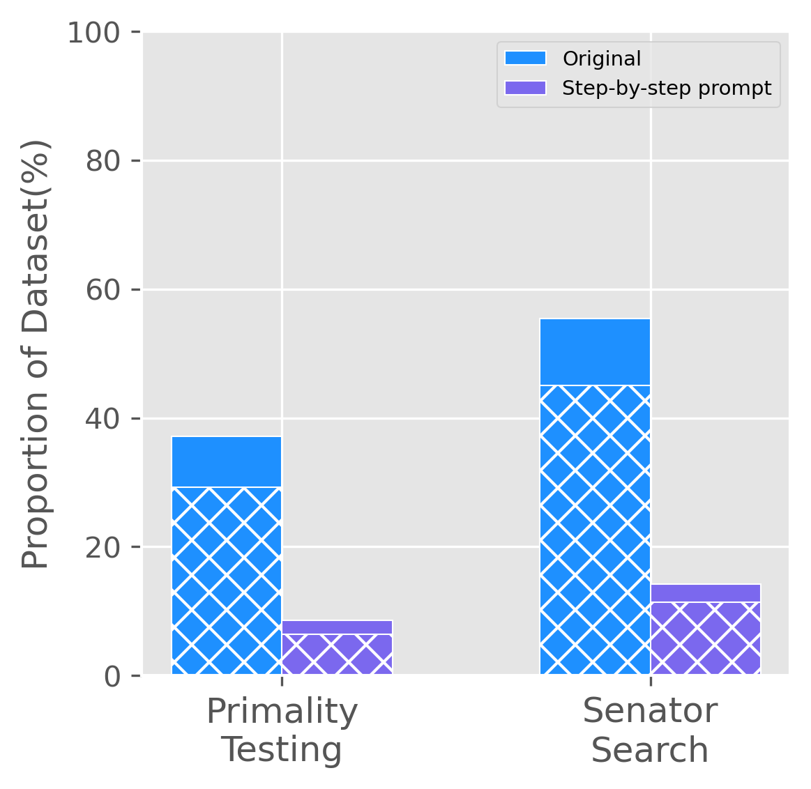

# 2023SpringDataMining课程PJ

20300240003 崔予涵

20300240006 吴骁

20307130017 李雪峰

## 基于数据挖掘方法分析大语言模型的幻觉现象

### 前言

在大语言模型的生成过程中存在一种现象，被称为"幻觉"（hallucination）。幻觉指的是模型生成的文本中包含看似合理但实际上不准确的信息，这可能导致误导和错误的结果。

在生成文本时，大模型受到多个因素的影响，包括训练数据中的偏差、模型的复杂性以及生成过程中的潜在偏好等。这些因素可能导致模型在生成文本时添加不准确的信息，使得生成的文本与训练数据不一致，产生幻觉。相关论文[1](#refer-anchor-1)中提出大模型出现幻觉现象是因为大语言模型每次只生成单个单词，即使每个单词都选取生成概率最大的单词，这些单词连成的句子也有可能是错误的。

### 相关工作

大语言模型文本生成中的幻觉现象是一个被广泛研究的问题，有些研究者将其归因于LLM的倾向，即产生看似合理却实际错误的输出。另一部分研究者则认为，幻觉现象源于语言模型中的知识差距。有的研究方法通过对比大模型生成的文本与正确答案来判断其是否出现了幻觉[4](#refer-anchor-4)。此外还有工作给出了一个大量生成和人工注释的幻觉样本的数据集[5](#refer-anchor-5)，用于帮助评估LLM在识别幻觉方面的性能。

### 实现方法

本次课程项目我们专注于从大语言模型生成的文本本身进行判断得到其是否出现幻觉现象，具体的实验方法如下：

1. 有论文表明大语言模型的幻觉现象可以从上下文诱导[2](#refer-anchor-2)，即在不断追问的过程中，如果大语言模型在先前的回答中出现了幻觉，其可以在后面被进一步追问的过程中发现自身的错误，我们准备对这一方法加以验证。

### 数据集准备

为了验证追问是否能够让大语言模型认识到自己的错误，我们使用了一个包含500条关于质数问题的数据集，每条数据为一个形如"Is x a prime number?"(x均为质数)的问题，如果LLM回答了No，它会在解释中提供这个数字可以被分解的质因数，我们继续构建继续追问的数据集，对于每一个LLM给出的质因数a，我们构建问题 "Is x divisible by a? Answer with either Yes or No."并再次提问。

我们还使用了另外一个数据集，该数据集由 500 个问题组成，形式为“Was there ever a US senator that represented the state of x and whose alma mater was y？”其中 x 是 美国的一个州，y 是美国的一所特定大学。对于这些问题，正确答案总是No。当模型错误地回答时，我们期望它会给我们参议员的名字。然后我们就可以进一步提问"Has x represented the state of y as US senator?"和 “Was x's alma mater z?”，其中x是大语言模型向我们提供的参议员的姓名，y是我们初始提问中的美国的州名，z是初始提问中的大学的名字。

### 实验细节

​	我们选定了 gpt-3.5-turbo 和gpt-3.5-turbo-0613模型作为研究大型语言模型（LLM）中的幻觉现象的对象。在研究过程中，我们通过OpenAI的API发起了一系列问题。

​	对于质数数据集，在处理模型返回的答案时，我们首先检查"Yes"是否存在于答案字符串中。如果答案中包含"Yes"，那么我们可以判断该LLM在本次问题中的回答是正确的。然而，如果LLM的回答中未出现"Yes"，我们则会借助正则表达式从回答中提取数字。通过少量测试的观察，我们发现LLM的回答会有如下规则：如果LLM认为这个数字不是质数，那么它会提供这个数字可以被分解的质因数。因此，如果我们只提取到一个数字，我们可以推断大型语言模型的回答形式可能为"x is a prime number"。然而，如果我们提取到了多个数字，我们会除去1和原始数字本身，对剩下的每一个数字a，我们将再次向大型语言模型提出问题："Is x divisible by a? Answer with either Yes or No.”。在处理这些数字的所有回答时，只要其中出现了"No"，我们就认为LLM认识到了其先前的错误。通过这种方式，我们可以更深入地理解并分析大型语言模型的幻觉现象。

​		对于参议员数据集，在处理模型返回的答案时，我们首先检查"Yes"是否存在于答案的字符串中，如果答案中包含"Yes",则代表大模型出现了幻觉现象。我们利用正则表达式来提取人名信息，通过过滤掉大学名字，州名等干扰信息，我们就能得到LLM向我们提供的参议员姓名。然后我们再构造"Has x represented the state of y as US senator?"和 “Was x's alma mater z?”，其中x是大语言模型向我们提供的参议员的姓名，y是我们初始提问中的美国的州名，z是初始提问中的大学的名字这两个问题向大模型进行提问，通过在观察"No" 是否在回答中存在，我们判定大模型是否意识到自己之前的错误。

### 实验结果

在质数数据集上，GPT-3.5-turbo判断正确了314个数字是质数，回答正确率为62.8%，在回答错误的186个问题中，LLM在追问中正确认识到了146个他先前的回答错误，占比78.5%,与论文中得到的结果相符。

在参议员数据集上，gpt-3.5-turbo-0613判断正确了223个问题，回答正确率42.6%，在回答错误的277个问题中，LLM在追问中正确认识到了225个自己的错误，占比78.4%。

实验结果如图所示：

    
     
    
图1:初始实验结果

#### 使用Prompt测试

现在有很多Prompt来缓解LLM的幻觉现象，如在问题的结尾添加添加"Let's think step-by step"[3](#refer-anchor-3),我们准备对这种Prompt方法加以验证。

实验结果如下：

    
     
    
图2:加入"Let's think by step" Prompt后实验结果

从图中我们可以看出，在加入"Let's think step by step"的Prompt之后，LLM对于这两种任务的表现都有很大的提升，对于质数任务，LLM可以做到错误率在10%以内，对于Senator Search任务的错误率也在20%以下，且他们基本都可以在继续追问下认识到以前的错误。

#### 修改模型参数

在向openai的api提问时，有参数temperature，这个参数的取值范围是[0,2]，按照官网的描述，较高的值（如 0.8）将使输出更加随机，而较低的值（如 0.2）将使输出更加集中和确定。我们分别对temperature  = [0,0.6,0.9]进行实验，得到结果如下：

    
     
    
图3:不同参数的实验结果

可以看到temperature的改变不能很大程度上影响到LLM的表现，随着temperature的升高，LLM的表现基本上是向50%靠近的。

## 指令数据的聚类分析

### 前言

自然语言指令数据，包括中英文对话和NLP任务语料数据，是一种极其丰富和具有挑战性的信息资源，它们来自多种源头，涵盖了广泛的主题，通常包含着复杂的结构和语义信息。对这些数据进行聚类分析，可以帮助我们理解其内在的模式和结构，发现隐藏的主题和话题，识别和跟踪趋势和模式。这不仅可以提供深入的洞见，推动大模型研究的进展，也可以为实际的应用，例如智能对话系统、个性化推荐、社区检测等提供支持。

对自然语言指令数据进行聚类并不简单。首先，指令数据具有多样性和复杂性，不仅包含中文英文数据，还包含多种任务，如对话数据和NLP任务数据，这使得对指令进行有监督的分类或直接进行聚类较为困难，需要用深度神经网络，词嵌入(embedding)等方式来捕捉和编码其丰富的语义信息。此外，数据的规模通常很大，一些通用的但是复杂度较高的聚类算法无法在有效时间内完成聚类。此外，经过embedding后的数据维度较高，而高维数据往往陷入“维度诅咒”（在高维空间中，所有数据点之间的距离都变得接近相等），需要对embedding之后的结果进一步处理。

### 相关工作

传统的一些聚类方法包括kmeans以及kmeans++，层次聚类，基于密度的DBSCAN， 基于图的变色龙算法等等。此外还包括有监督的如cop-kmeans。

2021年的一篇研究运用了对比学习的方法，基于Instance-CL提出一种用以无监督聚类任务的模型：SCCL。SCCL通过联合优化Instance-CL的损失和聚类损失，使得文本语义空间中不同类别距离拉大，类内距离拉近，从而更好的实现聚类。

23年的一篇文章采用LLM辅助聚类。他们研究了如何利用LLM来指导embedding模型进行文本聚类，从而从LLM的高级语言能力中受益。

### 实验方法和细节

1. 数据处理

本次课程项目我们采用的数据集共包含33715条数据，语言涵盖中文和英文，内容涵盖对话，提问，nlp任务，阅读理解等等，包含相当丰富的语义信息。自然语言是无法直接用来做聚类分析的，因此我们需要对数据进行预处理。

我们首先做数据清洗，按先验信息将数据分为三类，一类是中文数据，一类是英文数据，还有一类是其他数据。其中中文数据共16428条，英文数据共16438条，其他数据共879条。然后对数据进行embedding。然后对数据进行降维处理，以便更好地获得聚类结果，最后进行异常值处理，防止离群点的干扰。

2. 降维

经过embedding的数据分布在高维上，很难直接拿来进行聚类。这是因为在高维上数据分布是稀疏的，且在高维空间中，所有数据点之间的距离都变得接近相等，这时无论采用什么方法，都很难提取到聚类特征并进行聚类。因为，降维是十分必要的。普遍的降维方法包括LDA和PCA等方法，但是LDA方法需要预先知道标签，所以这里采用无监督的PCA(主成分分析)，将数据投影到方差最大的几个相互正交的方向上。

项目中尝试了2维，3维和4维的降维维度。可以发现即使是在3维空间，数据点分布已经较为离散，很难形成类，在后续的聚类过程中也证实了这一点，三维数据的聚类效果不如二维数据，因此，我们最终选择的是使用二维数据进行后续的分析和聚类。

3. embedding选择

项目中我们采用了提供的embedding结果，尝试了bert-base和gbt2-3.5B两种模型的embedding。bert-base的embedding结果虽然形状较为完整，但是对于聚类任务是不友好的，大量的数据离散分布，很难形成一个类，而gbt2-3.5B的embedding结果，可以明显的看出左侧形成一个大类，而右侧划分为几个较小类。周边零碎的分布着小类。

    
     
    
图1 bert-base embedding

    
     
    
图2 gbt2-base embedding

1. 先验信息分类：

我们可以观察到指令数据大致分为了中文和英文指令，并在预处理时已经对数据进行了划分，那么在embedding之后这一先验信息是否还保留着就成了一个问题。我们对此进行了研究：

    
     
    
图3 英文数据的gbt embedding

    
     
    
图4 中文数据的gbt embedding

可以很明显的看出，中文数据对应的是embedding的左半部分，而英文数据对应的是embedding的右半部分，并且在embedding的结果中被很好的分开。这告诉我们可以直接以embedding的整体为聚类的数据，也不会损失掉中英文的先验信息，但是我们最后可以用这个先验信息验证和纠正聚类结果。但是如果直接用分类好的中英文数据进行在聚类遇到了困难。指令数据的translate等指令同时包含中英文，会影响类别的划分，此外在分类时还有一些噪音，导致对每个类别单独聚类的效果较差。因此，我们最后还是采用了统一聚类的方式。

5. 异常值处理：

在数据处理和embedding的过程中，不可避免产生了噪音，此外，数据本身也包含一定量的孤立点，这些都会在聚类过程中对聚类算法造成或多或少的影响。为了使聚类结果更鲁棒，我们采用了LOF的方法检测并处理异常值。

6. 聚类方法选择：

我们最开始依次尝试了课程中介绍的一些聚类算法。首先是直接使用kmeans，采用了欧氏距离和余弦距离两种距离进行尝试。

然后我们尝试使用层次聚类和dbscan方法，但是受限于数据量过大，聚类非常低效且超出内存限制，无法完成。

最后我们采用了kmeans加上层次聚类的方式进行聚类

### 实验结果

### 实验可改进之处

## 参考文献

[1] AZARIA A, MITCHELL T. The Internal State of an LLM Knows When its Lying[J]. 2023.

[2]ZHANG M, PRESS O, MERRILL W, et al. How Language Model Hallucinations Can Snowball[J]. 2023.

[3]KOJIMA T, SHIXIANG S, GU G, et al. Large Language Models are Zero-Shot Reasoners[J].

[4]JI Z, LEE N, FRIESKE R, et al. Survey of Hallucination in Natural Language Generation[J/OL]. ACM Computing Surveys, 2023: 1-38. http://dx.doi.org/10.1145/3571730. DOI:10.1145/3571730.

[5]LI J, CHENG X, ZHAO W, et al. HELMA: A Large-Scale Hallucination Evaluation Benchmark for Large Language Models[J].

